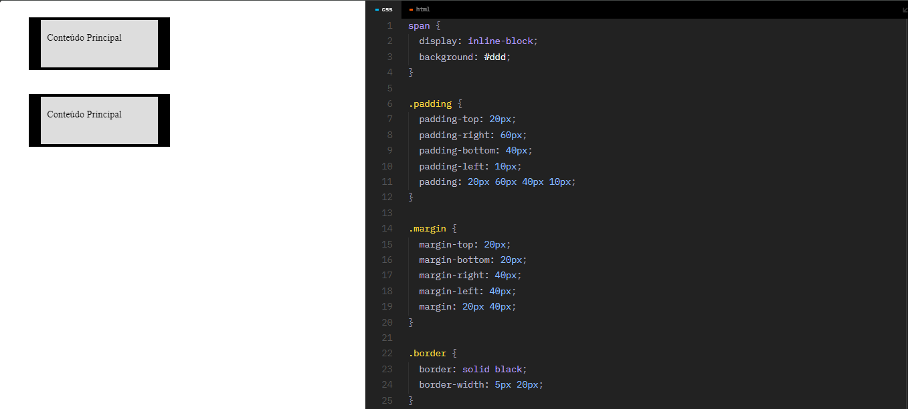
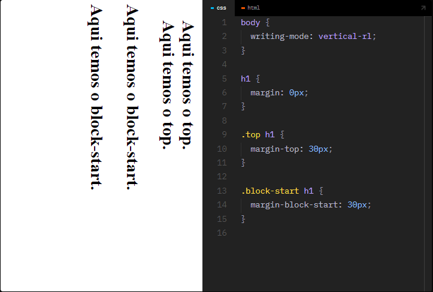

# > TOP, RIGHT, BOTTOM E LEFT

- Propriedades como ``margin``, ``padding`` e ``border`` permitem definirmos valores diferentes para cada um dos lados da caixa (box model).

---

## > Inline Block 

- Os valores de top, bottom, right e left são relativos ao documento. Para valores relativos a caixa (box) que pode ser influenciada pelo modo de escrita, use ``inline-start``, ``inline-end``, ``block-start``, ``block-end``.

---