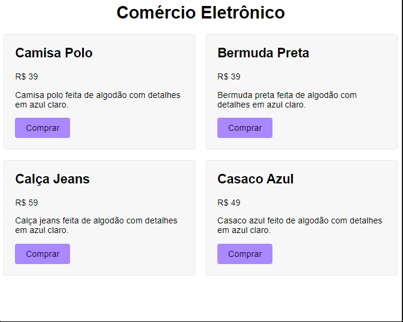

# Grid Templete Columns

## Grid

- Com o ``display: grid;`` é possível definirmos colunas e linhas para organizarmos os elementos que estiverem dentro do grid.

### grid-template-columns

- Define o total de colunas e o tamanho de cada uma.

### FR 

- fr é uma unidade fracionária que terá como objetivo distribuir o espaço restante, entre os elementos do grid.

### gap 

Cria uma distância entre os elementos do grid, tanto horizontal quanto vertical.

---

## Align e Justify-content

### Align-content 

- Alinha/Distribui o conteúdo na vertical.

### jutify-content

- Alinha/Distribui o conteúdo no horizontal. 

### place-content

- Atalho para align e justify.

### valores

- ``start | center | end | stretch | space-between | space-around | space-evenly``

---

