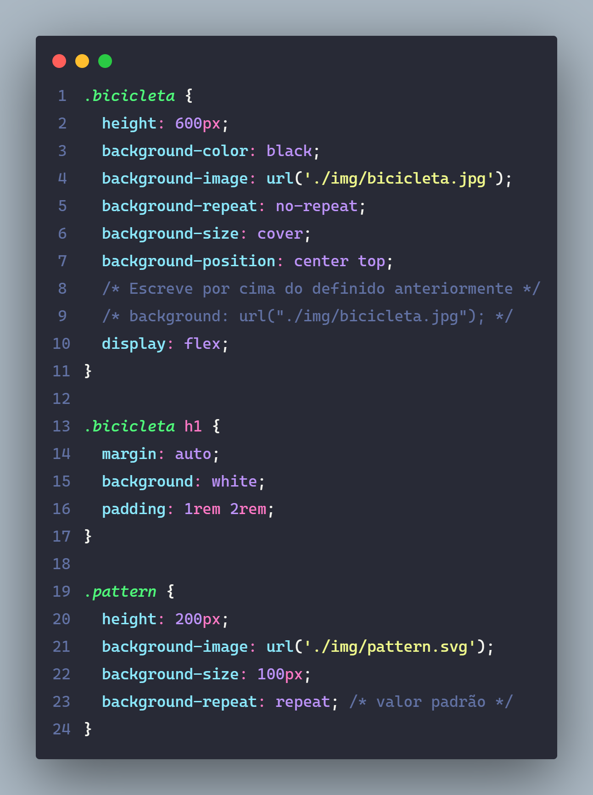
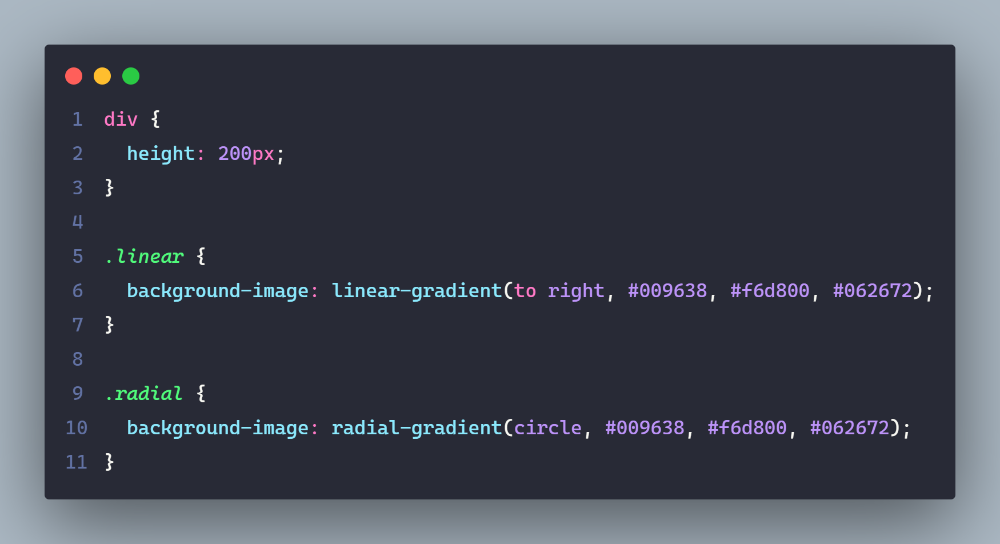
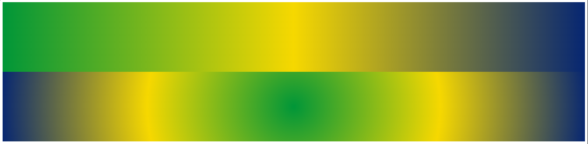

# Backgrounds

> O background pode receber outros valores além de cores sólidas, como imagens e gradientes. A diferença entre img e o background é que a img faz parte do conteúdo, o background apenas do estilo.

---

---

---

## Gradiente

> A função ``linear-gradient`` gera um gradiente linear na propriedade background-image.

### Direção

- 90deg, 45deg, to left, to right

### Colors

- ``#000 0%, blue 50%, #fff 100%. Cor e local de início.``

---

---

---

### Referências / Autoria

- Refrência do [Curso da Origamid](https://www.origamid.com/), modificado e exemplicação e estruração [Gabriel-Dev](@GabrielFelipeOliveiraRateiroDev).