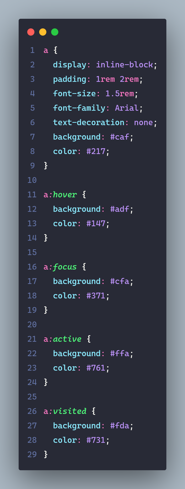
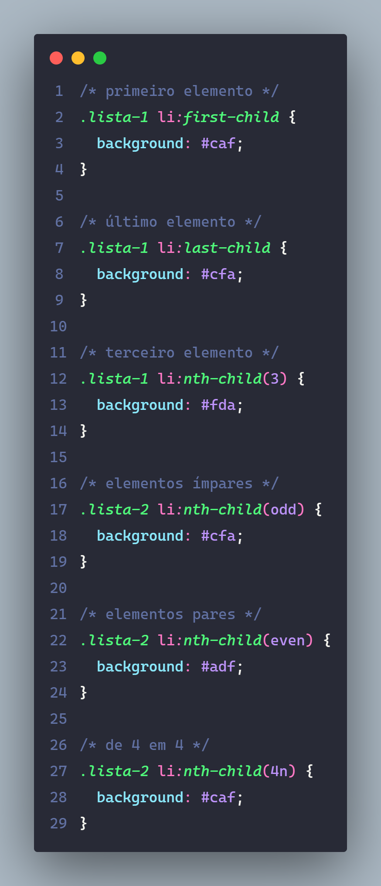
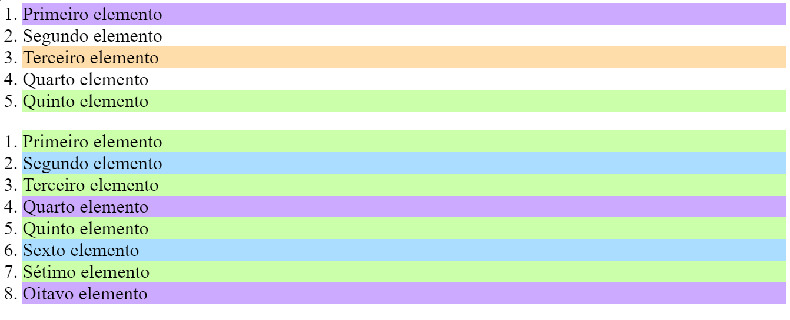
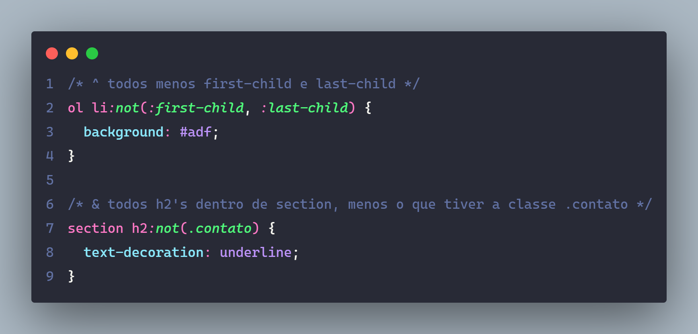
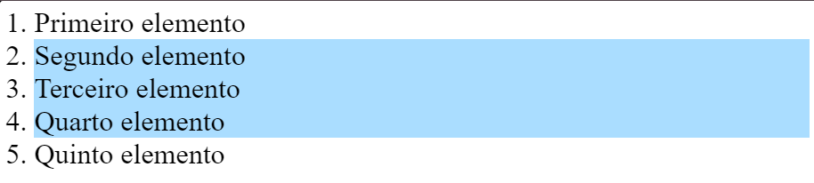

# Pseudo Classes

## Estado

> Permite definirmos estilos em diferentes estados no elemento HTML.

### ``:hover``

- Mouse por cima.

### ``:focus``

- Elemento em foco, usando o teclado (tab).

### ``:active``

- Quando clicamos no elemento.

### ``:visited``

- Para links que já foram visitados.

---

---

## Seletores

### ``:first-child``

- Selecioa o primeiro elemento.

### ``:last-child``

- Selecino o último elemento.

### ``:nth-child(3)``

- Seleciona o elemento que deseje do fluxo do html.4 (quarto elemento), even (pares), odd (ímpares), 3n (de 3 em 3).

---

---

---

## ``:Not``

> O ``:not`` nega a seleção de um elemento específico.

---

---

---

[Lista Outros Pseudoclasse](https://developer.mozilla.org/en-US/docs/Web/CSS/Pseudo-classes)

---

### Referências / Autoria

- Refrência do [Curso da Origamid](https://www.origamid.com/), modificado e exemplicação e estruração [Gabriel-Dev](@GabrielFelipeOliveiraRateiroDev).