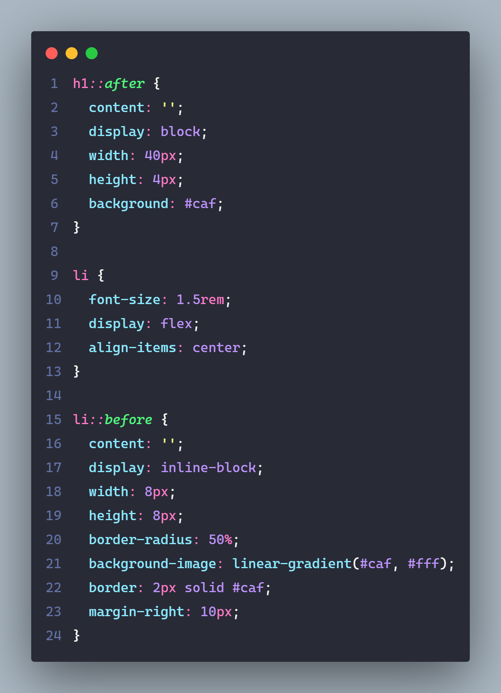
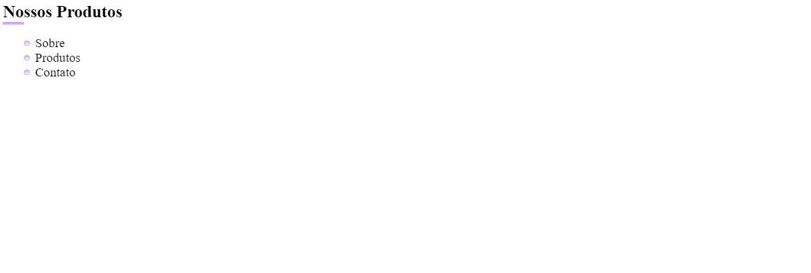
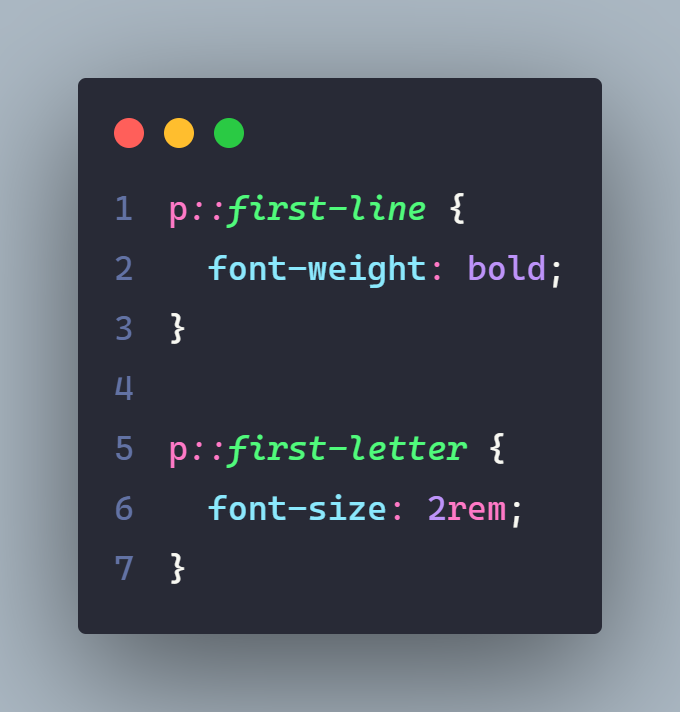
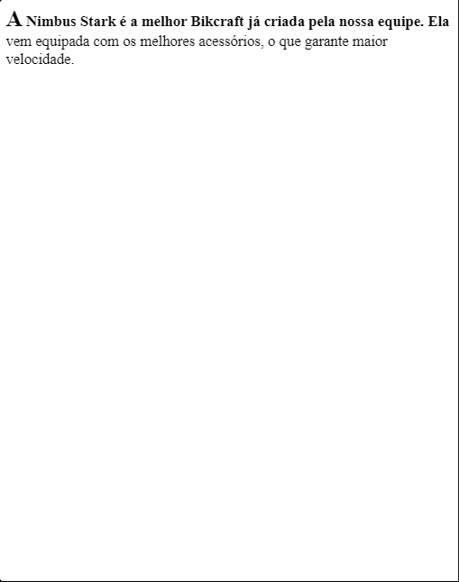

# Pseudo Elementos

## ``::before`` e ``::after``

> Os pseudo elements ``::before`` e ``::after`` criam conteúdo antes e depois dos elementos ``HTML`` com base no seletor. Puramente com ``CSS``, **sem a necessidade de criarmos novos elementos no HTML**.

---

### Content

- Defíne um contúdo para o elemento é essencial o seu uso para que exista o pseudo elemento, mesmo em casos que o seu conteúdo seja vazío.

### Uso

- Ele são muito ultilizaveis, em ocasiões no qual desejamos criar econteúdo de estilos expecíficos, tornando a manipulação do conteúdo gerado puramente com CSS "maleavel" (simple e direto), impactando de forma positíva e direta em seu UI (User Interface)-(Interface de Usuário), sem a nessecidade de criarmos novos elementos HTML.

---

---

---

## ``::first-line`` e ``::first-letter``

### ``::first-line``

- Seleciona a primeira linha do conteúdo.Assim, podemos estilizar esse fragmento de texto de forma independente.

> ``Nota:`` _É importante ressaltar que não há uma maneira trivial (Não há uma maneira conhecida por todos) de definir até onde o texto será estilizado, principalmente quando lidamos com páginas responsivas. Ao redimensionar uma página, a primeira linha pode se tornar maior ou menor, e isso também depende de outros fatores, como o tamanho da fonte, espaçamento entre palavras, entre outros._

### ``::first-letter``

- Seleciona a primeira letra do conteúdo.Usamos esse recurso quando desejamos destacar essa letra adicionando estilos expecíficos ao conteúdo.

> ``Nota:`` _Em alguns casos esse recurso pode identificar que algum caractere deve ser selecionado junto com a primeira letra, como quando temos aspas no início do texto. Quando isso acontece, tanto as aspas duplas quanto a primeira letra serão selecionadas e estilizadas. Essa característica se deve ao fato de ``::first-letter`` tentar se adequar às particularidades da escrita de cada idioma._

---

---

---

### Referências / Autoria

- Refrência do [Curso da Origamid](https://www.origamid.com/), modificado e exemplicação e estruração [Gabriel-Dev](@GabrielFelipeOliveiraRateiroDev).