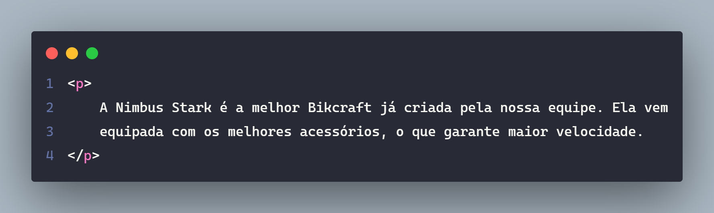
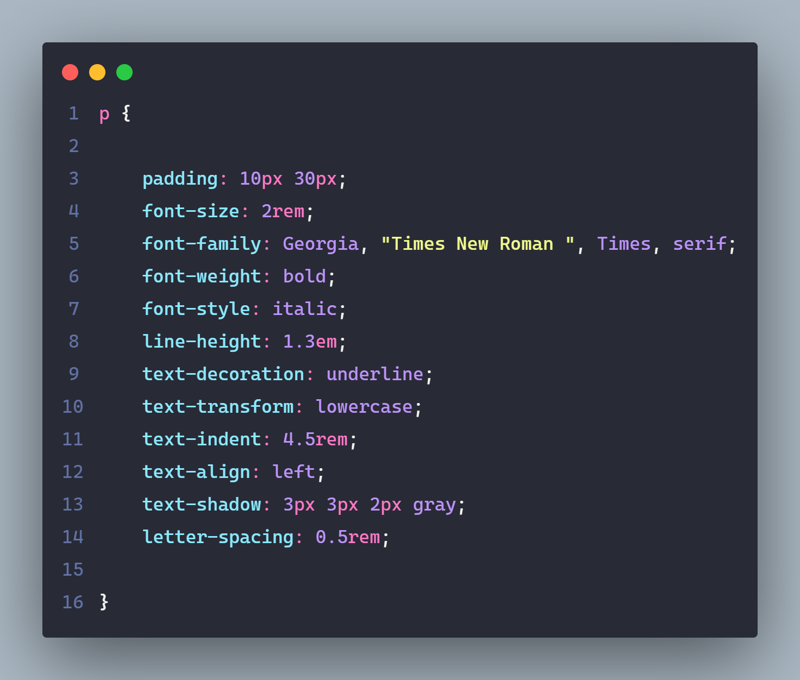
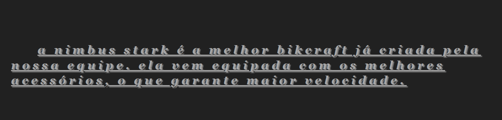

# Tipografia

> Existem diversas propriedades diferentes para ajustarmos a tipografia do site. Geralmente começam com ``font`` ou ``text``.

---

---

---

---

## Referências / Autoria

- Refrência do [Curso da Origamid](https://www.origamid.com/), modificado e exemplicação e estruração [Gabriel-Dev](@GabrielFelipeOliveiraRateiroDev).