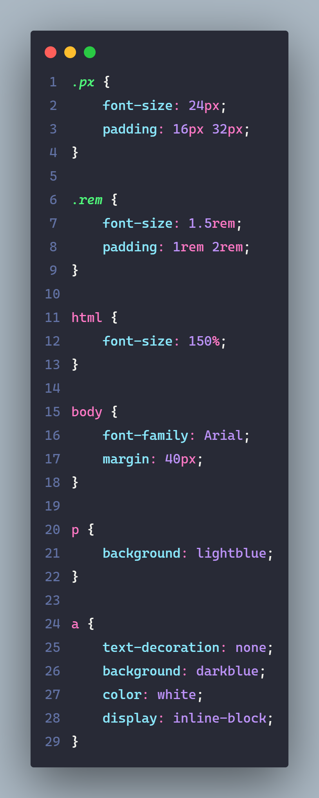

# Unidades

## Rem

> Unidade relativa ao tamanho da fonte do elemento raiz ``HTML``. Na maioria dos Browsers a configução padrão de ``1rem = 16px``.

---

#### CSS

---

#### Resultado

---

## Em 

> ``em`` é uma unidade relativa ao tamanho da fonte do ``elemento pai``.

---

#### CSS

---

#### Resultado

---

## vh e vw

> ``vh`` representa o tamanho da altura da tela visível (viewport height) e ``vw`` da largura (viewport width). ``100vw = 100% da tela.``.

### Observações

> Antes do vh só existia a porcentagem. A porcentagem é problemática para definir o height, pois: ``height: 100%;`` significa 100% da altura do pai. A altura do pai sempre é definida pelo tamanho do conteúdo, então basicamente ``100% de height`` não muda em nada.

**100vh será 100% da altura da tela, independente da quantidade de conteúdo.**

---

#### CSS

---

#### Resultado

---

## Calc

> ``calc()`` é uma função de css que retorna um valor com base no cálculo efetuado entre os ``()``. Podemos combinar unidades.

### calc(100vw / 3)

- Representa 1/3 da tela.

### calc(100% - 20px)

- Representa 20px de 100%.

---

#### CSS

---

#### Resultado

---

## Outras Unidades

> Existem outras unidades, confira no link abaixo:

[Documentação](https://developer.mozilla.org/en-US/docs/Learn/CSS/Building_blocks/Values_and_units)

---

### Referências / Autoria

- Refrência do [Curso da Origamid](https://www.origamid.com/), modificado e exemplicação e estruração [Gabriel-Dev](@GabrielFelipeOliveiraRateiroDev).