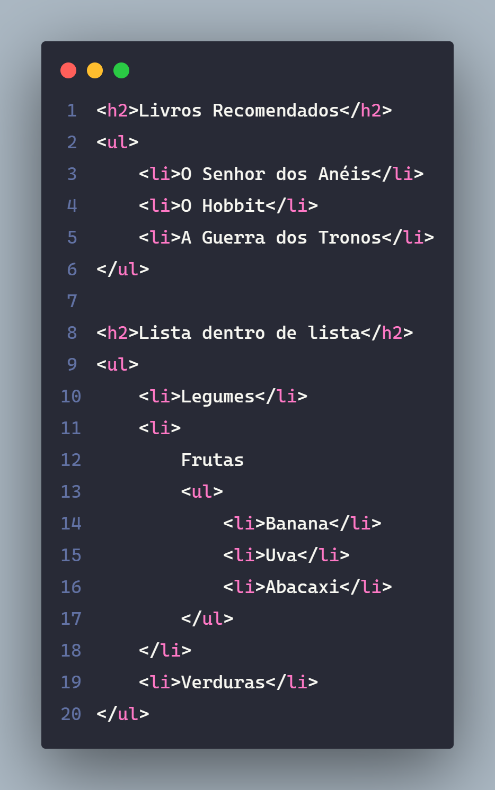
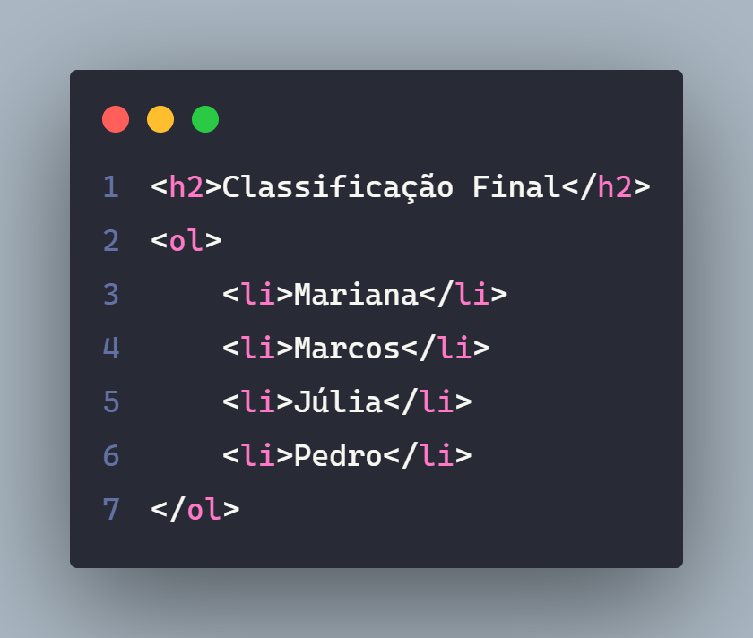
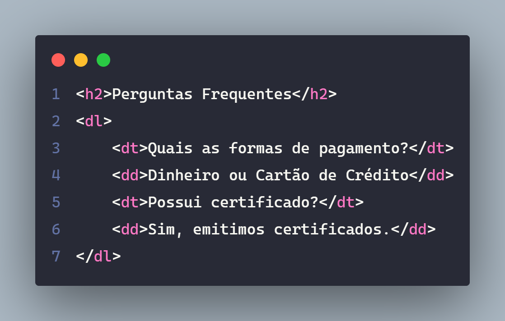
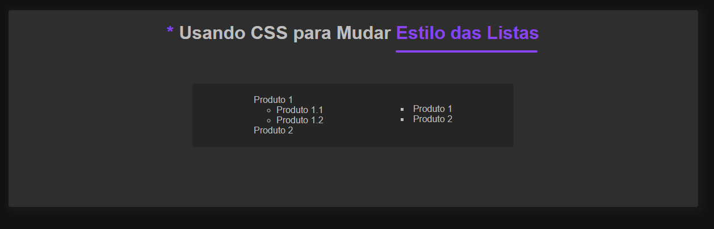

# Lista

## UL

> A tag ``<ul>`` marca uma lista de itens sem ordem (unordered list). Cada item da lista deve ser marcado com uma ``<li></li>``

---

### Acessibilidade

- Lista são anunciadas pelo leitor de tela e o usuário é informado préviamente quantos items exitem na lista.

---

---

## OL

> A tag ``<ol>`` marca uma lista ordenada (ordered list).

---

---

## DL

> A tag ``<dl>`` marca uma lista de descrições (description list). A lista é criada com dois elementos ``<dt>`` e ``<dd>``.

### dt

- Marca o termo/frase a ser definido.

### dd

- Marca a definição do termo acima.

---

----

## CSS

> As listas não são utilizadas apenas para textos simples, é possível agruparmos uma lista de produtos em uma ul > li. Para isso geralmente removemos os estilos padrões definidos por listas.

### list-style

- Possui diferentes valores que definem o estilo dos marcadores da lista (disc, square e outros). O list-style define o tipo / imagem / posição (outside / inside)

``- Lembrando que essas modificaações de estilo será apenas visual, se sua lista esta dando alguns significado de preferência em usar tags semânticas, afinal ja vimos o problema que isso resulta em seu códigos, faça boas escolhas e seu código será mais evidênte na internet! - Gabriel Felipe de Oliveira Rateiro``

---

#### HTML

---

#### CSS

---

#### Resultado do código

---

## Referências / Autoria

- Referência [Curso Origamid](https://www.origamid.com/), modificações por [Gabriel-Dev](@GabrielFelipeOliveiraRateiroDev)