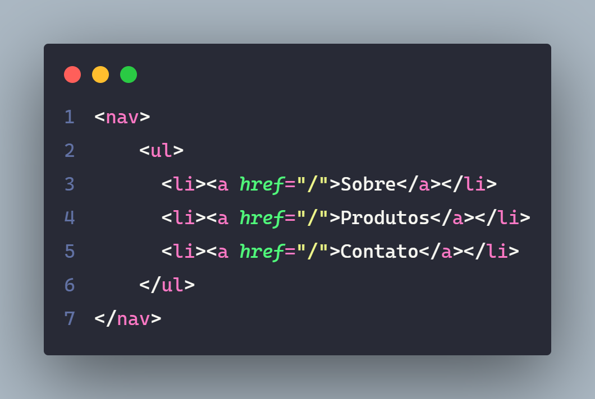

# Navegação

> O uso mais comum de listas é na marcação de blocos de navegação, pois um menu é uma lista de links. 

---

---

## Sem Lista

- Não é obrigatório o uso de listas para criar uma navegação.

- Uma discussão sobre o assunto gerou os pontos positivos e negativos do uso sem listas, a conclusão foi de que com listas seria o ideal.

[Documentaçao](https://css-tricks.com/navigation-in-lists-to-be-or-not-to-be/)

[Documentação2](https://css-tricks.com/wrapup-of-navigation-in-lists/)

---

### Referências / Autoria

- Refrência do [Curso da Origamid](https://www.origamid.com/), modificado e exemplicação e estruração [Gabriel-Dev](@GabrielFelipeOliveiraRateiroDev).