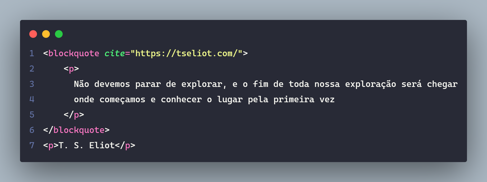
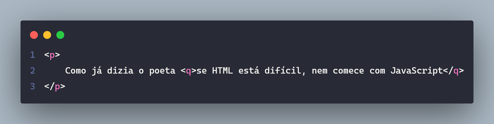
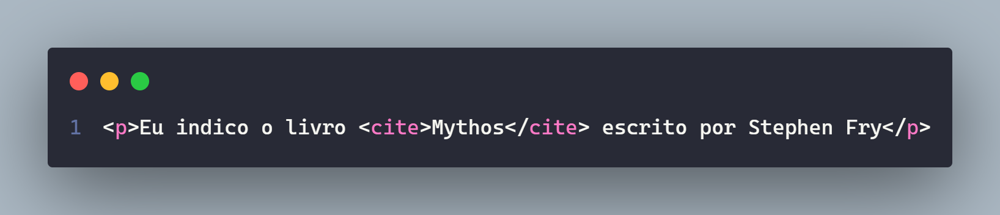
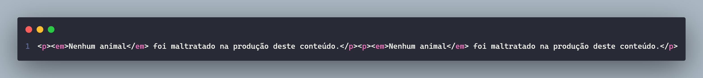
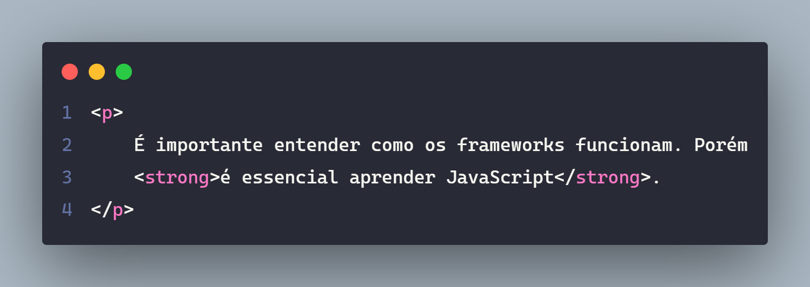

# blockquote, q, cite, em, strong

## blockquote

> lockquote marca uma citação extensa e recebe um atributo cite com a fonte.

---

---

## q

> ``q`` marca uma citação inline (no texto).

---

---

## cite

> ``cite`` é utilizada para citar o nome de um trabalho, livro, filme, peça ou algo parecido. Não é para citar autor.

---

---

## em

> ``em`` é utilizada para dar enfase em uma frase/palavra no texto.

---

---

## strong

> ``strong`` é utilizada para marcar uma parte importante do conteúdo.

---

---

### Referências / Autoria

- Refrência do [Curso da Origamid](https://www.origamid.com/), modificado e exemplicação e estruração [Gabriel-Dev](@GabrielFelipeOliveiraRateiroDev).