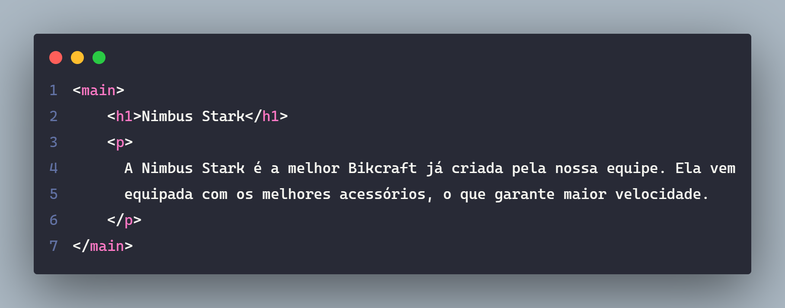
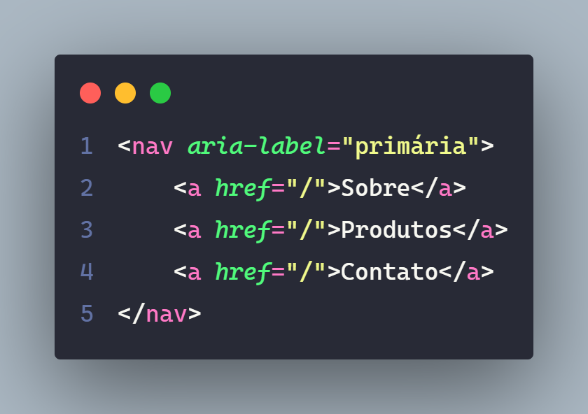
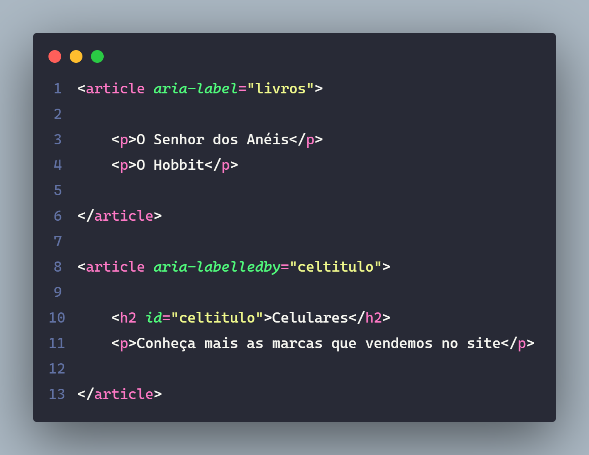
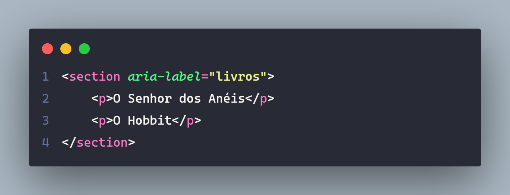
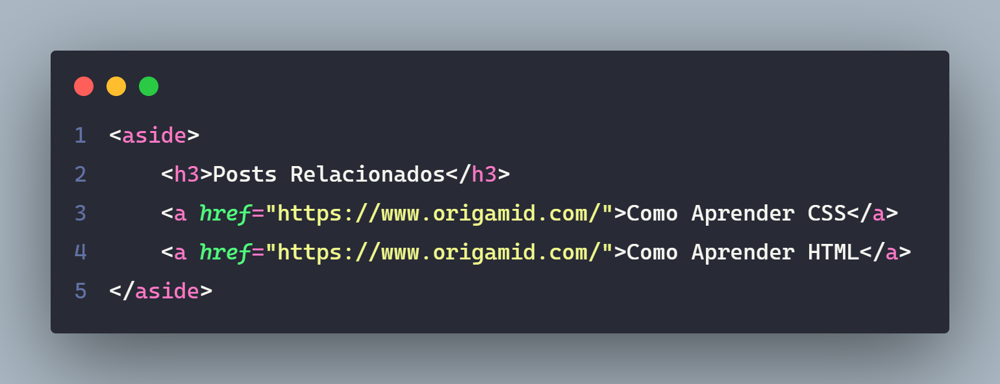
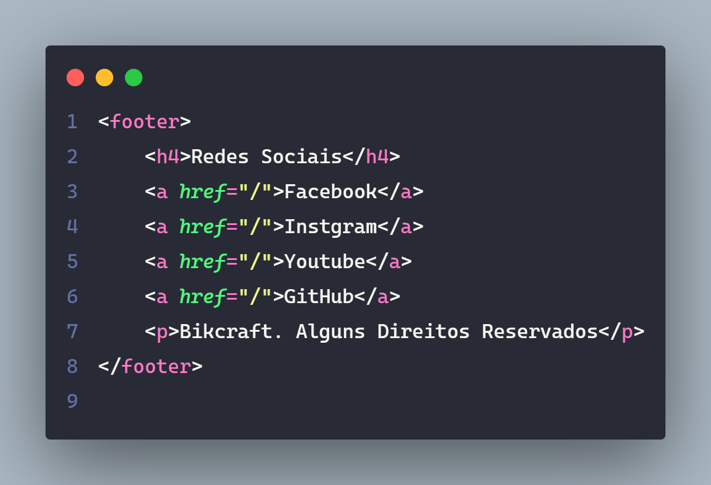

# Pontos de Referência

## Landmarks

> Tags que marcam pontos de referência (landmarks) foram introduzidas no lançamento do HTML5. Antes era utilizado o atributo ``role``.

> Visualmente o efeito que essas tags possuem é similar ao das div's, elas não mudam em nada o conteúdo/apresentação. (section altera os headers).

    ``` html
    
        <main>
        <nav>
        <section>
        <article>
        <aside>
        <footer>
        <header>

    ```

---

## main

> A tag ``<main>`` marca o conteúdo principal da página.

---

### Exemplos

- Blog: conteúdo do artigo. Comércio eletrônico: descrição/imagem/preço do produto.

### Observação

- Utilize uma por página.



---

## Navegação

> A tag ``<nav>`` marca um bloco de navegação.

### Exemplos

- Geralmente utilizado para a navegação primária e secundária do site.

### Observações

- Evite o uso de diversas tags ``nav``, use apenas para a navegação essencial.



---

## Article 

> A tag ``article`` representa uma região do site que é autoexplicativa (não precisa do restante do site para fazer sentido). Geralmente deve conter um título (h's).

### Exemplos

- Lista de produtos do site, um artigo, post na rede social e outros.

### aria-label

- Título da região visualmente escondido, mas lido pelo leitor de tela.

### aria-labelledby

- Caso o título exista na tela, marque o mesmo com um ``id`` e use este atributo para criar uma relação entre eles.

### Observação

- Oficialmente não cria uma landmark, mas muitos leitores de tela utilizam ela como referência para marcar regiões do site. A tag é até mais consistente do que a section para marcar regiões do site.

---

[Documentação](https://www.smashingmagazine.com/2020/01/html5-article-section/)

---



---

## Section

> A tag ``section`` pode ser utilizada para agrupar o conteúdo do site em diferentes regiões. Geralmente o conteúdo necessita do seu contexto para ser compreendido.

### aria-label

- Se utilizada com o atributo ``aria-label`` cria uma região do site.

### Observação

- O h1 é impactado em termos visuais quando utilizado na section. O section foi criado para melhor lidar com os headings, porém a sua idealização nunca foi implementada (até hoje 2021):

---

[Documentação](https://adrianroselli.com/2016/08/there-is-no-document-outline-algorithm.html)

---



---

## Aside

> A tag ``aside`` é utilizada para marcar conteúdo complementar ao principal do site.

---

### Exemplos

- Lista de posts mais visitados, informações extras como a descrição de um termo usado no artigo e mais.



---

## header

> A tag ``<header>`` marca o cabeçalho do site (banner), onde geralmente estão presentes a marca, navegação do site e as vezes uma informação introdutória.

---

### Exemplos

- Pode também ser utilizada para marcar o cabeçalho de regiões como o título de um artigo, data, autor e outras informações.

### Observação

- Apenas cria uma landmark se não estiver dentro de main, section, article ou aside.


---

## Footer

> A tag ``<footer>`` marca o rodapé do site, geralmente contém informação sobre os direitos autorias, quem escreveu e links para documentos relacionados.

### Observações

- Apenas crie uma landmarkse não estiver dentro de main, section, article, ou aside.

---



---

## Referências / Autoria

- Referência [Curso Origamid](https://www.origamid.com/), modificações por [Gabriel-Dev](@GabrielFelipeOliveiraRateiroDev)