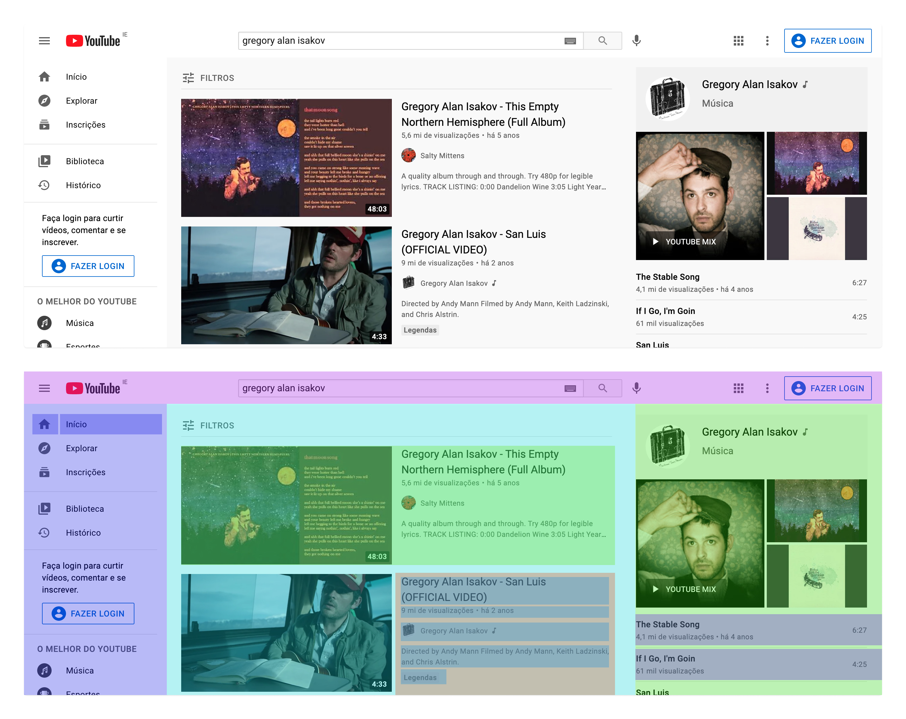
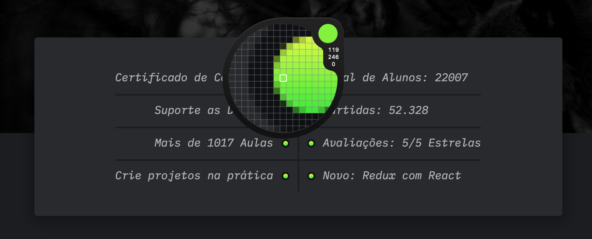
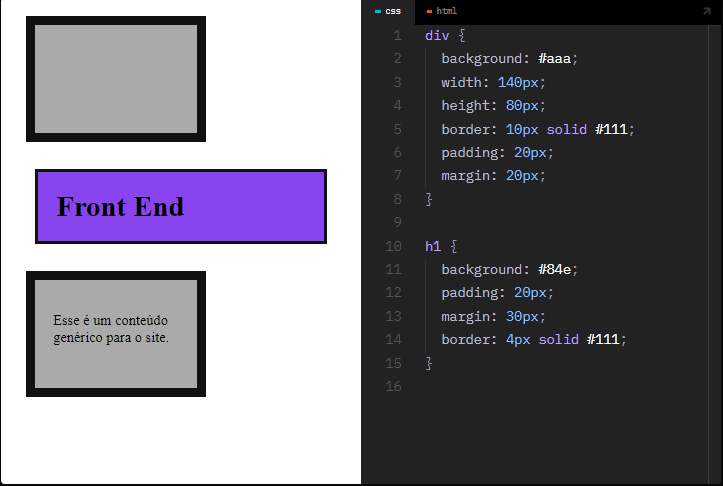

# BOX MODEL

## Caixas

> Uma interface web é composta de diversas caixas que organizam o conteúdo. Veja abaixo!

---

## BOX MODEL

> Content (conteúdo)

- define a largura inicial da caixa (salvo elementos de bloco).

---

> Padding (preenchimento)

- Separa o conteúdo das bordas da caixa. É a margem interna.

---

> Border (borda)

- Define bordas para a caixa.

---

> Margin (margem)

- Define a distância entre uma caixa e outra.

---

> Width (largura)

- A largura total da caixa, por padrão é o somatório do conteúdo + padding (left/right) + border (left/right).

---

> Height (altura)

- A altura total da caixa, por padrão é o somatório do conteúdo + padding (top/bottom) + border (top/bottom).

---

---

## PIXEL

>Unidade de referência  
É a unidade de referência da Web, pois as telas são desenvolvidas em pixels.

---

> Monitores  
Um monitor de: 3840 (largura em px) x 2160 (altura em px) = 8.294.400.

---

> px em CSS 
No CSS o pixel (px) é uma unidade de referência e não representa 1 pixel exato do seu dispositivo (é adaptável em relação à densidade da tela).

---

---

## DIV 

> A < div > é um elemento de bloco block genérico que serve para auxiliar no posicionamento dos elementos/conteúdo na tela. 
Existem também elementos semânticos como main, section, nav e outros que veremos em outras aulas.

---

## FERRAMENTAS

> **VisBug**  
<a href="https://chrome.google.com/webstore/detail/visbug/cdockenadnadldjbbgcallicgledbeoc
">VisBug<a>

---

> **PixelSnap**  
<a href="https://getpixelsnap.com/">PixelSap</a>

---
