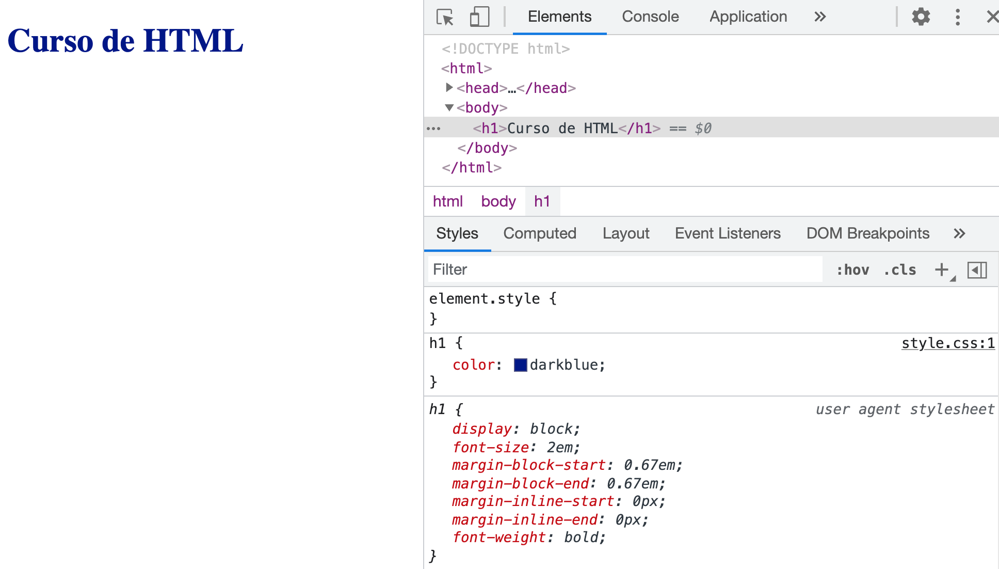
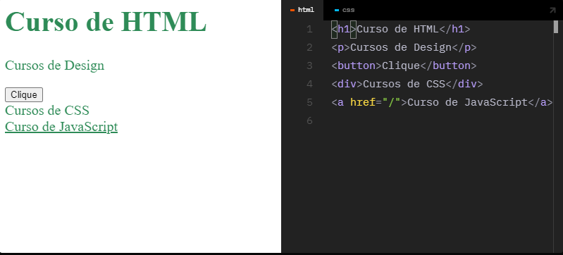

# Estilos do Browser

## Estilos do Browser

### Padão

- Os browsers possuem um css inicial que é aplicado ao documento.

### H1 vs P

- Por isso quando marcamos um h1 o texto fica maior/negrito em relação a um texto marcado com um p.

---

## Reset, Reboot e Normalize

- Algumas soluções foram criadas para lidar com os estilos iniciais. O principal objetivo delas é reduzir a inconsistência entre os browsers.

## Reset

- Remove parte dos estilos iniciais

<a href="https://meyerweb.com/eric/tools/css/reset/">Vaja.</a>

---

## Normalize

- Normaliza os estilos iniciais entre os browsers sem remover os mesmos.

<a href="https://necolas.github.io/normalize.css/">Veja.</a>

---

## Reboot

- É uma mistura de reset e normalize utilizada pelo Bootstrap.

<a href="https://raw.githubusercontent.com/twbs/bootstrap/main/dist/css/bootstrap-reboot.css">Veja.</a>

---

## inherit (herança)

- Existem propriedades do CSS que são passadas do pai para o filho como uma herança (inherit).

### Exemplos

- color, font-size, font-family e outras.

### Padrão vs Herança

- O valor padrão irá escrever por cima da herança. Por isso ao definirmos uma color no body, os < a > não mudam de cor.

